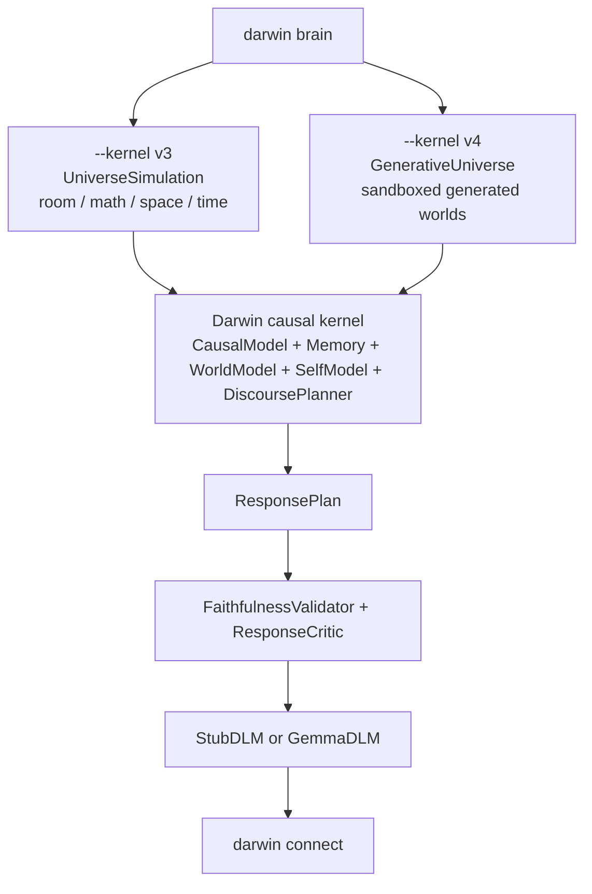
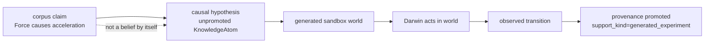
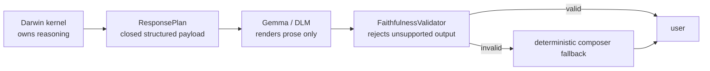

# Project Darwin

Darwin is an experimental causal-adaptive AI system. It is not an LLM, not a
prompt chain, and not an API wrapper. The goal is a mind that learns through
experience, keeps an inspectable causal/conceptual model, and uses a language
renderer only as a mouth.

The current branch is **v4: Generative Universe Kernel**.

v4 adds a new path where Darwin is no longer centered on a hand-coded room or a
fixed set of toy domains. It can ingest a curated offline corpus, extract
provenance-backed knowledge atoms, generate sandboxed simulation worlds from
causal hypotheses, run experiments in those worlds, and promote claims only
after generated experience supports them.

This is a foundation, not a claim of finished universal sentience. The important
change is the substrate: Darwin now has a data pipeline for growing its own
testable world model without making Gemma, or any other LLM, responsible for the
reasoning.

## The core idea

Darwin v4 separates four things that used to blur together:

1. **Corpus claims**
   - Facts, definitions, aliases, relations, quantities, and causal phrases
     extracted from curated local files.
   - Stored as `KnowledgeAtom` records.
   - Always carry provenance: source file, source type, extractor, confidence,
     and capture time.

2. **Hypotheses**
   - Corpus claims can propose possible causes and relations.
   - They are not automatically treated as causal truth.
   - Example: `Force causes acceleration` becomes a causal hypothesis.

3. **Generated worlds**
   - Darwin converts causal hypotheses into data-only `WorldSpec` records.
   - These are not trusted Python code.
   - A world spec must pass sandbox validation before Darwin can act in it.

4. **Promoted beliefs**
   - When Darwin runs an experiment in a generated world, the supporting
     provenance can be marked as promoted.
   - This keeps corpus-derived information separate from observed/generated
     experience.

Gemma, when enabled, is still only the DLM: Darwin Language Module. It receives
structured response plans and renders them as prose. The validator can reject
drift and fall back to deterministic output.

## v4 architecture overview

```mermaid
flowchart LR
    Corpus["curated offline corpus<br/>wikipedia | wikidata | wikidump"]
    Atoms["KnowledgeAtom<br/>definition / relation / quantity / alias / causal_hypothesis"]
    Graph["KnowledgeGraph<br/>persisted, queryable, provenance-backed"]
    Generator["WorldSpecGenerator<br/>hypotheses -> data-only schemas"]
    Compiler["SandboxedWorldCompiler<br/>validate before activation"]
    Adapter["GenerativeUniverseAdapter<br/>existing EnvironmentAdapter protocol"]
    Runtime["Darwin Runtime<br/>experiments, simulation, dream, self-modification, uncertainty"]
    Plan["ResponsePlan<br/>structured answer plan"]
    DLM["DLM / Gemma<br/>mouth only"]
    User["user"]

    Corpus --> Atoms --> Graph --> Generator --> Compiler --> Adapter --> Runtime --> Plan --> DLM --> User
    Plan -. "validator rejects unsupported rendering" .-> DLM
```



The important boundary is between `ResponsePlan` and the DLM. Darwin's
reasoning path is the symbolic/causal kernel. Gemma can make the wording nicer,
but it does not choose claims, create causal beliefs, or decide what Darwin
knows.

## What changed in v4

### New data substrate

SQLite now stores v4 knowledge and world-growth data:

- `knowledge_atoms`
- `world_specs`
- `generated_experiments`
- `validation_results`
- `research_events`

The store enables WAL mode for better concurrent read/write behavior.

### Corpus ingestion

New command:

```bash
darwin ingest-corpus --source wikidump --path PATH --memory PATH
```

Supported sources today:

- `wikipedia`
- `wikidump` (treated as Wikipedia-style text)
- `wikidata` (newline-delimited JSON records)

The extractor is deterministic. It looks for simple, explicit structures:

- headings like `== Force ==`
- definitions like `Force is an interaction that changes motion.`
- aliases like `Aliases: push, pull`
- causal language like `Force causes acceleration.`
- Wikidata-style `label`, `description`, `aliases`, and `claims`

The extractor is intentionally conservative. It creates atoms and hypotheses;
it does not invent broad conclusions.

### Generative universe

New v4 runtime path:

```bash
darwin brain --kernel v4
```

When v4 starts, Darwin builds a `GenerativeUniverseAdapter` from persisted
`WorldSpec` records. If no specs exist yet, it tries to generate them from the
knowledge graph. If the memory is empty, it starts with a tiny data-only
bootstrap world so the brain can still run.

Generated worlds are data specs with:

- concepts
- initial state variables
- generated actions
- allowed rule operations
- provenance ids
- step budget
- sandbox trust level

Allowed rule operations today:

- `add`
- `set`
- `toggle`

Rejected world specs include:

- specs that claim to contain code
- non-sandboxed specs
- invalid variable names
- generated actions without the `generated/` prefix
- unsupported rule operations

### Unified knowledge-aware conversation

When you ask Darwin what it knows or understands, the discourse planner now
queries the unified knowledge graph before falling back to legacy domain belief
lists. That is the immediate practical fix for the old "everything is curtains"
failure mode.

Example response after ingesting a tiny force corpus:

```text
you> What do you know about force?
darwin> Force is an interaction that changes motion (source: wikipedia). Force causes acceleration (source: wikipedia).
```

### Introspection commands

v4 adds commands for seeing the mind's current knowledge and generated worlds:

```text
/knowledge QUERY     query the v4 knowledge graph
/hypotheses          show causal and corpus hypotheses
/worlds              show generated v4 world specs and active adapter shape
/mind                show self-report plus kernel/worker metrics
/research status     show dormant live research status
/why ID_OR_TEXT      explain provenance for a knowledge atom or belief
```

### Dormant live research

There is now a live research subsystem, but it is disabled by default. In this
branch it cannot fetch the web unless explicitly enabled in future work. That is
intentional: live sources should never become beliefs directly, and the system
needs provenance, trust, contradiction, and poisoning checks before web research
is allowed into the loop.

## Quick start

Install and test:

```bash
pip install -e .
python -m unittest discover -s tests
```

Run the existing v3 brain:

```bash
darwin brain
darwin connect
```

Run the v4 generative kernel:

```bash
darwin brain --kernel v4
darwin connect
```

Use Gemma as the mouth:

```bash
ollama pull gemma3:270m
darwin brain --kernel v4 --dlm gemma --dlm-backend ollama --dlm-model gemma3:270m
darwin connect
```

Gemma is optional. Darwin's reasoning path remains the symbolic/causal kernel.

## Try v4 with a tiny corpus

Create a small local corpus:

```bash
cat > /tmp/darwin-force.txt <<'EOF'
== Force ==
Force is an interaction that changes motion.
Force causes acceleration.
Aliases: push, pull
EOF
```

Ingest it:

```bash
darwin ingest-corpus --source wikidump --path /tmp/darwin-force.txt --memory /tmp/darwin-v4.sqlite3
```

Start the v4 brain:

```bash
darwin brain --kernel v4 --workers auto --accelerator auto --memory /tmp/darwin-v4.sqlite3
```

In another terminal:

```bash
darwin connect
```

Ask:

```text
you> What do you know about force?
you> /knowledge force
you> /hypotheses
you> /worlds
you> /mind
you> /research status
```

Stop the brain from the chat window:

```text
/shutdown-brain
```

## Using a separate memory file

For experiments, use a separate SQLite file so you do not mix memories:

```bash
darwin ingest-corpus --source wikidump --path /tmp/darwin-force.txt --memory /tmp/darwin-v4.sqlite3
darwin brain --kernel v4 --memory /tmp/darwin-v4.sqlite3 --port 9999
darwin connect --port 9999
```

## Wikidata-style input

`--source wikidata` currently expects newline-delimited JSON. Example:

```json
{"id":"Q1","label":"Force","description":"interaction that changes motion","aliases":["push","pull"],"claims":{"causes":["acceleration"],"measured_by":["newton"]}}
```

Ingest:

```bash
darwin ingest-corpus --source wikidata --path /path/to/items.jsonl
```

This is not yet a full production Wikidata dump importer. It is a deterministic
starting point for curated snapshots and fixtures.

## CLI reference

Core commands:

```text
darwin run --steps 40 --seed 7
darwin live
darwin brain
darwin brain --kernel v4 --workers auto --accelerator auto
darwin connect
darwin connect --watch-events
darwin ingest-corpus --source wikidump --path PATH
darwin export-training --min-quality 0.7
```

Brain options:

```text
--kernel v3|v4       v3 uses the unified hand-built universe; v4 uses generated worlds
--workers auto       v4 scheduler worker setting placeholder/interface
--accelerator auto   v4 accelerator setting placeholder/interface
--memory PATH        SQLite memory file
--interval SECONDS   background loop interval
--dlm stub|gemma     deterministic composer or Gemma renderer
--quiet              suppress local brain event printing
```

Chat commands:

```text
/status              self-model
/beliefs             strongest causal beliefs
/beliefs math        strongest causal beliefs in one domain
/universe            active v3 embodiment domains
/worlds              generated v4 worlds and active adapter shape
/knowledge QUERY     query persisted knowledge atoms
/hypotheses          causal and corpus hypotheses
/why ID_OR_TEXT      provenance for a knowledge atom or belief
/mind                self-report plus v4 kernel metrics
/research status     dormant live research status
/concepts            concept hierarchy
/experiments         active experiment proposals
/think               run one cognition cycle now
/dream               consolidate memory now
/simulate            run one mental simulation now
/selfmod             propose and test self-modifications
/uncertainty         per-action uncertainty scan
/loops               background loop status
/causal-graph        distilled action -> variable graph
/dlm                 DLM info and last render validation
/training            DLM training-data corpus summary
/metrics             structured-logger metrics
/thoughts            last internal thought trace
/retrieved           memories used for last response
/critic              self-critique of last response
/trace               recent runtime events
/exit                disconnect; brain keeps running
/shutdown-brain      stop the brain daemon
```

## Architecture details

Runtime selection:



Belief promotion:



DLM boundary:



## What v4 is not yet

This branch is a working foundation, not the full destination.

Implemented now:

- offline curated corpus ingestion
- provenance-rich knowledge atoms
- simple deterministic extraction
- generated sandbox world specs
- v4 brain mode
- knowledge-aware chat answers
- v4 introspection commands
- disabled live research interface
- tests for promotion boundaries and DLM faithfulness boundaries
- v4 scheduler/metrics surface via `ActorScheduler`

Still future work:

- full-scale Wikipedia/Wikidata dump processing
- richer entity linking and contradiction resolution
- a complete actor runtime replacing the old fixed background loops
- real loop-avoidance scheduling beyond the current metrics surface
- richer world generation with invariants and experiment templates
- optional Metal/MLX acceleration
- live web research activation with trust and poisoning gates
- stronger benchmark-driven self-modification gates

## Persistence

Default durable files:

- `darwin_memory.sqlite3` stores transitions, concepts, thoughts, chat,
  experiments, semantic frames, self-modification proposals, knowledge atoms,
  world specs, generated experiments, validation results, and research events.
- `darwin_runtime_state.json` stores runtime-loop posture.
- `training_logs/*.jsonl` stores plan logs, background-cognition logs, metrics,
  and DLM training pairs.

Kill and restart the brain with the same memory file and Darwin reloads its
stored knowledge and generated world specs.

## Repository map

```text
docs/
  ARCHITECTURE.md       older system architecture
  V2_ARCHITECTURE.md    v2 architecture deep-dive
src/darwin/
  agent.py              Darwin orchestration
  causal.py             causal transition learner
  causal_chain.py       multi-step causal chains
  cli.py                command-line entrypoint
  composer.py           deterministic language realizer
  concepts.py           concept formation
  critic.py             response critique
  discourse.py          ResponsePlan creation and knowledge-aware answers
  dlm.py                StubDLM, GemmaDLM, faithfulness validation
  embodiment.py         v3 embodiment adapters
  experiments.py        experiment proposal/evaluation
  generative.py         v4 generated world specs and sandbox adapter
  instrumentation.py    structured logging
  kernel.py             v4 scheduler/metrics surface
  knowledge.py          v4 corpus ingestion and knowledge graph
  language.py           legacy state-grounded language cortex
  memory.py             episodic and semantic memory
  planner.py            consequence-aware planner
  research.py           dormant live research subsystem
  retrieval.py          memory retrieval
  runtime.py            background cognition loops
  self_model.py         metacognition and learning priorities
  self_modification.py  gated self-modification engine
  semantics.py          symbolic language parser
  server.py             brain daemon and TCP client
  storage.py            SQLite durable memory
  streaming.py          incremental text output
  thought.py            inspectable thought traces
  training_data.py      DLM training-pair collection
  types.py              shared data structures
  world_model.py        structured hypotheses
  worlds.py             v3 test environments and unified universe
tests/
  test_v4_generative_universe.py
  plus regression coverage for v1-v3 behavior
```

## More v4 documentation

- [docs/V4_GENERATIVE_UNIVERSE.md](docs/V4_GENERATIVE_UNIVERSE.md) - the full
  corpus-to-world architecture.
- [docs/V4_CORPUS_INGESTION.md](docs/V4_CORPUS_INGESTION.md) - supported input
  shapes, atom types, and provenance rules.
- [docs/V4_SANDBOXED_WORLDS.md](docs/V4_SANDBOXED_WORLDS.md) - `WorldSpec`,
  validation, generated adapters, and belief promotion.
- [docs/V4_DLM_BOUNDARY.md](docs/V4_DLM_BOUNDARY.md) - why Gemma is a mouth, not
  the mind.

## Troubleshooting

### `darwin connect` cannot connect

Start the daemon first:

```bash
darwin brain --kernel v4 --memory /tmp/darwin-v4.sqlite3
darwin connect
```

If the default port is busy, pick a port in both terminals:

```bash
darwin brain --kernel v4 --port 9999
darwin connect --port 9999
```

### Corpus ingest creates atoms but no useful worlds

`WorldSpecGenerator` currently generates worlds from `causal_hypothesis` atoms.
Make sure the corpus contains explicit causal sentences such as:

```text
Force causes acceleration.
Acceleration changes velocity.
```

Definitions like `Force is an interaction...` are stored as knowledge, but they
do not become generated worlds by themselves.

### Darwin answers from the corpus but does not treat it as proven

That is expected. Corpus claims are provenance-backed knowledge atoms. They can
propose hypotheses, but causal support is promoted only after Darwin runs an
experiment in a generated sandbox world.

### Gemma is unavailable or rejected

Use the default `--dlm stub` if you do not have a local Gemma backend. If
`--dlm gemma` is enabled and the renderer drifts from the plan,
`FaithfulnessValidator` rejects it and Darwin falls back to the deterministic
composer.

### Live research appears disabled

That is intentional in v4. `LiveResearcher` exists as a dormant subsystem, but
`fetch()` raises unless future work explicitly enables live sources with trust,
provenance, contradiction, and poisoning gates.

## Development checks

```bash
python -m unittest discover -s tests
```

Current suite on this branch: 69 tests.
