# Project Darwin

Darwin is an experimental causal-adaptive AI system. It is not an LLM, not a
prompt chain, and not an API wrapper. The goal is a mind that learns through
experience, keeps an inspectable causal/conceptual model, and owns its own
language end-to-end.

The current branch is **v5: Self-Aware Generative Kernel**.

v5 builds on v4's corpus → atoms → generated worlds substrate and pushes hard
toward five things that v4 only set up scaffolding for: (a) Darwin being aware
of itself as an AI system, (b) generated worlds rich enough to express real
relations between variables, (c) zero LLM in the language pipeline, (d)
self-modification that actually accepts proposals and persists them, and (e)
a kernel that schedules cognition by priority rather than fixed timers.

## v5 in one picture



The kernel owns the reasoning. The realizer owns the words. The ledger owns
Darwin's history of self-tuning. None of those paths touches an LLM.

## What changed in v5

v5 lands in six phases (A → F), each its own commit on the `v5` branch.

### Phase A — Self-awareness substrate

`SelfIntrospector` lives next to `SelfModel`. Where `SelfModel` tracks
competence and learning priority, the introspector builds a `SystemIdentity`
at runtime that names what Darwin *is*: kernel mode, realizer kind, git
sha, memory path, and a `ModuleDescriptor` per active subsystem. Three new
chat commands surface it: `/identity`, `/architecture`, `/history`.

The v3 `Goal(desired={room.room_bright: True, ...})` leak is removed on the
v5 path — the goal surface is open until the kernel's curriculum scheduler
picks a target from the current learning priority.

### Phase B — Rich simulation substrate

Generated worlds in v4 were integer counters: each causal hypothesis became
one action that bumped one variable by `+= 1`. v5 adds a typed expression
AST (`ExpressionSpec`), new rule operations (`compute`, `clamp`, `if_then`),
derived rules that re-run to fixed point, and post-step invariants. Multiple
hypotheses that share an effect variable now compose into one world whose
derived rule wires them together.

A corpus of "Force causes acceleration" + "Mass resists acceleration"
no longer produces two disconnected counter-bumping worlds. It produces a
single `generated/composite_acceleration` world with two actions and a
derived rule `acc := force / max(mass, 1)` — the F=m·a relation, emergent
from the corpus, sandbox-validated, run by the kernel.



Three SQLite tables that v4 scaffolded but never filled
(`generated_experiments`, `validation_results`, `research_events`) are now
populated by the ingest path and the kernel.

### Phase C — LLM-free DiscourseRealizer

This is the largest single piece of work in v5. The Gemma DLM is removed
from the v5 inference path entirely. No model weights, no token sampling,
no HTTP call to ollama, nothing. A deterministic symbolic
`DiscourseRealizer` composes every utterance from `ResponsePlan` fields by
rhetorical strategies.

Every content word in the output must trace either to a plan field (or a
small set of morphological variants) or to a fixed structural vocabulary
of function words + connectors. `FaithfulnessValidator.check_content_words`
audits the output token-by-token. Variety comes from plan content
fingerprints, Darwin's current cognitive state, and a `StarterRegistry`
that avoids repeating recent sentence openers — never from sampling.


The acronym DLM is reinterpreted: **Darwinian Learning Module**. Language is
now part of the learning loop, tunable by self-modification, not a separate
mouth bolted on.

`--dlm gemma` is rejected on `--kernel v5` with a pointer to the realizer.
v3 and v4 paths keep `GemmaDLM` working unchanged.

### Phase D — Activated kernel

`ActorScheduler` in v4 was scaffolding: `runtime.py` ran five fixed-interval
daemon threads and never called the scheduler. v5 replaces those five
threads with one `KernelDriver` thread that pulls priority-ordered jobs from
a real heapq-backed scheduler. Per-kind saturation caps prevent any one
loop from dominating; the priority formula is
`0.6 * uncertainty + 0.3 * learning_priority_match + 0.1 * age`. `kernel_metrics` is finally non-zero.

The same `_loop_experiment` / `_loop_simulation` / `_loop_dream` /
`_loop_self_modification` / `_loop_uncertainty` methods double as job
handlers; a new `_handle_consolidation` lands for Phase F. Nothing in
Darwin's reasoning had to change — only the trigger surface.

### Phase E — Self-modification that actually fires

v4's accept gate was `improvement > 0.0` strict on a 12-sample integer-delta
holdout. The difference almost never exceeded zero, so every proposal
rejected. v5 rewrites the gate to a paired-bootstrap CI on per-sample
deltas (1000 resamples, 95% CI) with a 5% relative-improvement fallback,
on a 64-sample holdout. Proposals are now **declarative**: each kind has
an `(apply_factory, revert_factory)` pair in `_PROPOSAL_REGISTRY` that
reconstructs the closure purely from the payload dict, so an accepted
ledger row replays exactly.



Two new proposal kinds let Darwin tune its own substrate:
`realizer.config` (connector frequency, aside rate, qualifier strength)
and `kernel.priority_weight` (the scheduler's formula). On every restart,
`replay_ledger()` re-applies every accepted self-mod in `applied_at`
order, quarantining any payload that no longer fits its declared
`SAFETY_BOUNDS`. Darwin is a different mind each session.

### Phase F — Continuous compounding

`Memory.consolidate_redundant_concepts` collapses concepts with the same
`(kind, level, name)` signature down to the strongest-support copy.
`Memory.decay_stale_concepts` shrinks support over a configurable half-life
and drops anything that falls below 1. Both run inside the new
`consolidation` kernel job.

`KernelDriver._lift_starved_kinds` compares each kind's last-10-min
completion rate to its prior 10-min rate; a > 50% drop schedules a
priority-1.0 job of that kind. The scheduler records every such lift in
`KernelMetrics.starvation_lifts` so the self-mod loop has a real signal.

## Quick start

Install and test:

```bash
pip install -e .
python3 -m unittest discover -s tests
```

Run the v5 brain — no LLM required:

```bash
darwin brain --kernel v5
darwin connect
```

Ingest a corpus and watch the composite world emerge:

```bash
cat > /tmp/v5-physics.txt <<'EOF'
== Force ==
Force is an interaction that changes motion.
Force causes acceleration.

== Mass ==
Mass is a measure of matter.
Mass resists acceleration.
Aliases: inertia

== Acceleration ==
Acceleration is the rate of change of velocity.
EOF
darwin ingest-corpus --source wikidump --path /tmp/v5-physics.txt --memory /tmp/v5.sqlite3
darwin brain --kernel v5 --memory /tmp/v5.sqlite3 --port 9999
darwin connect --port 9999
```

In the chat window:

```text
you> /identity
you> /architecture
you> /worlds
you> /causal-graph
you> /history 20
you> What are you?
you> What is the relationship between force and mass?
you> /why composite.acceleration
```

After a sustained run, `/mind` shows `kernel_metrics` with non-zero
`jobs_completed`, `experiments_per_minute`, and `completions_by_kind` for
every kind. After a restart against the same memory file, `/history`
shows the replayed self-modifications and Darwin's tuned state persists.

`--dlm gemma` is no longer needed (and is rejected on v5). v3 and v4 still
support `--dlm gemma` and the Gemma path if you want to compare.

## CLI reference

Core commands:

```text
darwin run --steps 40 --seed 7
darwin live
darwin brain --kernel v5
darwin brain --kernel v4 --workers auto --accelerator auto
darwin brain --kernel v3
darwin connect
darwin connect --watch-events
darwin ingest-corpus --source wikidump --path PATH --memory PATH
darwin export-training --min-quality 0.7
```

Brain options:

```text
--kernel v3|v4|v5    v3 = hand-built universe; v4 = generated worlds with
                     fixed-interval daemons; v5 = generated worlds + kernel-
                     driven scheduler + symbolic realizer + ledger replay
--memory PATH        SQLite memory file (default: darwin_memory.sqlite3)
--port N             TCP port for clients (default: 9870)
--interval SECONDS   v3/v4 background loop interval (ignored on v5)
--workers N          v4 / v5 scheduler worker count
--accelerator auto   placeholder for future Metal/MLX acceleration
--dlm stub|gemma     v3/v4 only; v5 rejects --dlm gemma
--quiet              suppress local brain-event printing
```

Chat commands:

```text
/identity            structural self-image (name, version, kernel, modules)
/architecture        every module with role, class, public methods, state
/history N           recent self-modification ledger entries
/status              self-model report
/beliefs             strongest causal beliefs
/beliefs DOMAIN      strongest beliefs in one domain
/universe            active embodiment domains
/worlds              generated world specs + active adapter shape
/knowledge QUERY     query persisted knowledge atoms
/hypotheses          causal + corpus hypotheses
/why ID_OR_TEXT      provenance for a knowledge atom or belief
/mind                self-report plus kernel/worker metrics
/loops               on v5: kernel kind/in_flight/completed/rate. else: fixed loops.
/research status     dormant live research status
/concepts            concept hierarchy
/experiments         active experiment proposals
/think               run one cognition cycle now
/dream               consolidate memory now
/simulate            run one mental simulation now
/selfmod             propose and test self-modifications
/uncertainty         per-action uncertainty scan
/causal-graph        distilled action -> variable graph
/dlm                 DLM info + last render validation
/training            DLM training-data corpus summary
/metrics             structured-logger metrics
/thoughts            last internal thought trace
/retrieved           memories used for last response
/critic              self-critique of last response
/trace               recent runtime events
/exit                disconnect; brain keeps running
/shutdown-brain      stop the brain daemon
```

## Architecture in detail

The v5 cognitive loop has one more level of indirection than v4: the
scheduler stands between the runtime's background loops and the wall clock.


The realizer reads the same `ResponsePlan` shape v4 used. The
`FaithfulnessValidator` keeps its old structural checks (notation leak,
forbidden phrases, length sanity) and adds the strict content-word audit
on top. The composer fallback survives so a malformed plan can still
produce a grounded sentence.

## Persistence

Default durable files:

- `darwin_memory.sqlite3` stores transitions, concepts, thoughts, chat,
  experiments, semantic frames, knowledge atoms, world specs, generated
  experiments, validation results, research events, and the v5
  `self_mod_ledger`.
- `darwin_runtime_state.json` stores per-loop posture (used by the v3/v4
  fixed-interval drivers; v5 doesn't write to it).
- `training_logs/*.jsonl` stores plan logs, background-cognition logs,
  structured metrics, and DLM training pairs from v3/v4 runs.

Kill and restart `darwin brain --kernel v5` against the same memory file
and Darwin reloads transitions, world specs, knowledge atoms, and replays
every accepted self-mod from the ledger.

## What v5 is not yet

This branch is a working foundation, not the full destination.

Implemented now:

- Self-aware structural identity grounded in live module introspection
- Multi-hypothesis composite world generation with derived rules and invariants
- Counterfactual rollouts on generated worlds
- LLM-free symbolic discourse realizer with content-word grounded validation
- Priority-scheduled kernel with saturation caps and anti-thrash
- Paired-bootstrap accept gate for self-modification
- Persistent self-mod ledger with auto-replay and SAFETY_BOUNDS quarantine
- Memory consolidation and stale-concept decay
- All previously-scaffolded v4 tables (`generated_experiments`,
  `validation_results`, `research_events`, `self_mod_ledger`) populated
  end-to-end
- Tests: 133 tests across the v3, v4, and v5 paths, all green

Still future work:

- Full-scale Wikipedia / Wikidata dump processing
- Richer entity linking and contradiction resolution
- Active reading: live research with trust, contradiction, and poisoning gates
- Curriculum-driven world generation beyond simple composite rules
- Realizer self-mod targets beyond connector frequency / aside rate / qualifier strength
- Distributed scheduler workers behind the same `ActorScheduler` interface

## Repository map

```text
docs/
  ARCHITECTURE.md            older architecture notes
  V4_*.md                    v4 deep-dives (corpus ingestion, sandboxed worlds, ...)
  diagrams/                  rendered Mermaid SVGs + source .mmd files
src/darwin/
  agent.py                   Darwin orchestration; constructs SelfIntrospector
  causal.py                  causal transition learner
  causal_chain.py            multi-step causal chains
  cli.py                     command-line entrypoint; v5 wires
  composer.py                deterministic baseline language realizer (v3/v4)
  concepts.py                concept formation
  connectors.py              v5: function-word + connector vocabulary
  critic.py                  response critique
  discourse.py               ResponsePlan + DiscoursePlanner
  dlm.py                     StubDLM, GemmaDLM (v3/v4), SymbolicRealizerDLM (v5)
  embodiment.py              v3/v4/v5 embodiment adapters
  experiments.py             experiment proposal/evaluation
  generative.py              v5: ExpressionSpec, derived rules, invariants,
                             composite world generation, counterfactual
  instrumentation.py         structured logging
  kernel.py                  v5: heapq ActorScheduler + KernelDriver +
                             anti-thrash + priority formula
  knowledge.py               v5: KnowledgeGraph with relations_for/quantities_for
  language.py                legacy state-grounded language cortex
  memory.py                  v5: consolidate_redundant_concepts, decay
  planner.py                 consequence-aware planner
  realizer.py                v5: symbolic DiscourseRealizer pipeline
  research.py                dormant live research subsystem
  retrieval.py               memory retrieval
  runtime.py                 v5: start_v5() + _handle_consolidation
  self_awareness.py          v5: SystemIdentity, ModuleDescriptor, SelfIntrospector
  self_model.py              metacognition and learning priorities
  self_modification.py       v5: paired-bootstrap gate + declarative
                             _PROPOSAL_REGISTRY + replay_ledger
  semantics.py               symbolic language parser
  server.py                  brain daemon and TCP client
  storage.py                 v5: self_mod_ledger, list_self_mods, ...
  streaming.py               incremental text output (v3/v4)
  thought.py                 inspectable thought traces
  training_data.py           DLM training-pair collection
  types.py                   shared data structures
  world_model.py             structured hypotheses
  worlds.py                  v3 test environments
tests/
  test_v5_self_awareness.py  Phase A
  test_v5_worlds.py          Phase B
  test_v5_realizer.py        Phase C
  test_v5_kernel.py          Phase D
  test_v5_self_mod.py        Phase E
  test_v5_continuous.py      Phase F
  test_v4_generative_universe.py and all v1-v3 regressions
```

## Development checks

```bash
python3 -m unittest discover -s tests
```

Current suite on this branch: 133 tests, all passing.
