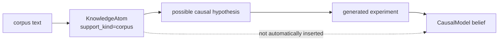

# Darwin v4 Corpus Ingestion

Corpus ingestion is the first stage of Darwin v4's generative universe path.
It turns curated local files into provenance-backed `KnowledgeAtom` records.
It does not train an LLM, call an LLM, or treat text as truth by default.

## CLI

```bash
darwin ingest-corpus --source wikipedia --path PATH --memory PATH
darwin ingest-corpus --source wikidump  --path PATH --memory PATH
darwin ingest-corpus --source wikidata  --path PATH --memory PATH
```

`--memory` defaults to `darwin_memory.sqlite3`, but using an explicit file is
recommended for experiments:

```bash
darwin ingest-corpus \
  --source wikidump \
  --path /tmp/darwin-force.txt \
  --memory /tmp/darwin-v4.sqlite3
```

In `src/darwin/cli.py`, `wikidump` is normalized to the `wikipedia` extractor
because the current implementation treats it as Wikipedia-style text.

## Pipeline

```mermaid
flowchart LR
    File["local corpus file"]
    Source["source type<br/>wikipedia | wikidata | wikidump"]
    Ingestor["CorpusIngestor.ingest"]
    Extract["deterministic extractor"]
    Atom["KnowledgeAtom"]
    Store["PersistentStore.record_knowledge_atom"]
    Graph["KnowledgeGraph.from_store"]
    Specs["WorldSpecGenerator.generate"]
    WorldStore["PersistentStore.record_world_spec"]

    File --> Source --> Ingestor --> Extract --> Atom --> Store --> Graph --> Specs --> WorldStore
```



## `KnowledgeAtom`

Implemented in `src/darwin/knowledge.py`.

```python
@dataclass
class KnowledgeAtom:
    kind: str
    subject: str
    relation: str
    object: str
    text: str
    provenance: Provenance
    confidence: float = 0.5
    promoted: bool = False
    support_kind: str = "corpus"
    atom_id: str = ""
```

Supported atom kinds in the current extractors:

| Kind | Meaning | Example |
| --- | --- | --- |
| `definition` | explicit "X is/are Y" statement | `Force is an interaction...` |
| `relation` | Wikidata-style claim relation | `Force measured_by newton` |
| `quantity` | definition that looks quantity-related | `Mass is a quantity measured in kilograms.` |
| `alias` | explicit alias list or Wikidata aliases | `Force alias push` |
| `causal_hypothesis` | explicit causal wording | `Force causes acceleration.` |

`atom_id` is a deterministic hash over kind, subject, relation, object, source
type, and source ID. Re-ingesting the same file does not duplicate atoms because
`knowledge_atoms.atom_id` is unique.

## `Provenance`

Every atom carries:

```python
@dataclass(frozen=True)
class Provenance:
    source_type: str
    source_id: str
    extractor: str
    confidence: float
    captured_at: float
```

For text sources, the extractor is currently `deterministic-text-v1` with a
provenance confidence of `0.72`. For Wikidata-style JSONL, it is
`deterministic-wikidata-v1` with a provenance confidence of `0.8`.

## Text input shape

The text extractor is intentionally simple. It looks for headings and explicit
sentence forms:

```text
== Force ==
Force is an interaction that changes motion.
Force causes acceleration.
Aliases: push, pull
```

This creates:

- a `definition` atom for `Force is an interaction that changes motion`
- a `causal_hypothesis` atom for `Force causes acceleration`
- `alias` atoms for `push` and `pull`

Definitions that contain words like "changes" are not double-counted as causal
hypotheses. This is covered by
`test_definition_containing_change_word_is_not_double_counted_as_causal`.

## Wikidata-style input shape

The current `wikidata` source expects newline-delimited JSON records, not a full
production Wikidata dump importer.

```json
{"id":"Q1","label":"Force","description":"interaction that changes motion","aliases":["push","pull"],"claims":{"causes":["acceleration"],"measured_by":["newton"]}}
```

Extraction behavior:

- `description` becomes a `definition`
- each alias becomes an `alias`
- each claim key/value becomes a `relation`

The current Wikidata extractor does not special-case claim names into
`causal_hypothesis`; it records them as relations. Text input with explicit
"causes", "changes", "affects", or "resists" language is the current path for
generated causal worlds.

## Claims are not beliefs



A corpus claim can answer "what does the knowledge graph contain?" with
provenance. It does not become a learned causal belief until Darwin experiences
an intervention and observes the resulting transition.

## Querying ingested knowledge

Start the v4 brain from the same memory:

```bash
darwin brain --kernel v4 --memory /tmp/darwin-v4.sqlite3
```

Then in `darwin connect`:

```text
/knowledge force
/hypotheses
/why Force causes acceleration
```

`/knowledge` uses `KnowledgeGraph.search()`, a lexical search over subject,
relation, object, and text. Results are sorted by match score, confidence, and
promotion status.

## Troubleshooting ingestion

### `atoms_created=0`

Check that the file exists and contains explicit patterns. The text extractor is
conservative and line-oriented.

### Atoms exist but `/worlds` shows no corpus-generated worlds

Only `causal_hypothesis` atoms generate `WorldSpec` records. Add explicit causal
sentences:

```text
Force causes acceleration.
Acceleration changes velocity.
Heat affects pressure.
```

### Re-ingestion creates fewer atoms than expected

`insert or ignore` deduplicates by `atom_id`. If the same subject/relation/object
comes from the same source path, the second ingest is expected to create zero new
rows.
