# Darwin v4 DLM Boundary

Darwin is not an LLM. Gemma is not Darwin's intelligence. The Darwin Language
Module (DLM) is a renderer: it receives a structured `ResponsePlan` from
Darwin's symbolic/causal kernel and turns that plan into prose.

This boundary matters more in v4 because the kernel now has a richer knowledge
and generated-world substrate. The DLM must not turn corpus text into belief,
invent missing support, or narrate unsupported causal reasoning.

## Ownership boundary



The DLM never receives hidden runtime state or raw thought traces as an open
prompt. It receives `ResponsePlan.to_dlm_payload()`, a strictly shaped object.

## `ResponsePlan` is the contract

Implemented in `src/darwin/discourse.py`.

Important fields:

- `mode`
- `intent`
- `thesis`
- `answer_points`
- `clarification_questions`
- `next_actions`
- `causal_claims`
- `referenced_experiences`
- `uncertainty_levels`
- `self_reflection`
- `confidence`
- `tone`
- `target_length`

The DLM payload intentionally excludes hidden state and raw trace internals.
`tests/test_v4_generative_universe.py` covers this with
`test_dlm_payload_for_v4_knowledge_does_not_include_raw_hidden_state`.

## Valid and invalid responsibility

| Decision | Owner |
| --- | --- |
| Which knowledge atoms are relevant | `KnowledgeGraph` + `DiscoursePlanner` |
| Whether a corpus claim is promoted | `DarwinRuntime` + `PersistentStore` |
| Which causal beliefs are exposed | `CausalModel` + `DiscoursePlanner` |
| Whether to answer or clarify | `DiscoursePlanner` |
| What exact prose wording to use | DLM or deterministic composer |
| Whether DLM output is acceptable | `FaithfulnessValidator` + `ResponseCritic` |

## Rejection flow



Validator rejection can happen when the renderer:

- drops high-confidence causal claims
- fails to surface important uncertainty
- adds unsupported numbers
- leaks parser/debug notation
- uses forbidden generic AI/training phrasing
- ignores clarification questions
- misses target length constraints

## v4 knowledge-answer example

After ingesting:

```text
Force is an interaction that changes motion.
Force causes acceleration.
```

The discourse planner can produce a `knowledge_answer` plan with answer points
like:

```text
Force is an interaction that changes motion (source: wikipedia)
Force causes acceleration (source: wikipedia)
```

The DLM may render that in natural language, but it cannot add:

- claims about Newtonian mechanics unless the plan contains them
- a statement that the claim is proven in the real world
- a new causal chain that Darwin did not produce
- confidence beyond the plan

## Why this is not a prompt chain


The language model is not asked "what should Darwin think?" The kernel has
already selected the structure of the response. The model is asked only to
render that structure faithfully.

## Running without Gemma

The default DLM is `stub`, which wraps the deterministic composer:

```bash
darwin brain --kernel v4 --dlm stub
```

To try Gemma as the mouth:

```bash
ollama pull gemma3:270m
darwin brain \
  --kernel v4 \
  --dlm gemma \
  --dlm-backend ollama \
  --dlm-model gemma3:270m
```

If Gemma is unavailable or rejected, Darwin falls back to the deterministic
composer. The symbolic/causal kernel still runs.

## Current limits

- Gemma can improve phrasing but not reasoning.
- The validator is a guardrail, not a proof of semantic perfection.
- The DLM training-data path records `(plan_payload, rendering)` pairs, but this
  branch does not ship a fine-tuned Darwin-specific Gemma model.
- Any future renderer must preserve the same boundary: mouth only, no belief
  creation.
