# Darwin v4: Generative Universe Kernel

Darwin v4 adds a corpus-to-world path around the existing symbolic/causal
kernel. It is not an LLM, not a prompt chain, and not an API wrapper. The
kernel still reasons through structured transitions, causal hypotheses, memory,
world state, and response plans.

The new piece is the substrate: Darwin can ingest curated offline knowledge,
turn explicit causal claims into sandboxed world specifications, act in those
worlds, and promote support only after generated experience backs a claim.

## What exists in this branch

| Area | Current implementation |
| --- | --- |
| Corpus ingestion | `darwin ingest-corpus --source wikipedia|wikidata|wikidump --path PATH --memory PATH` |
| v4 brain mode | `darwin brain --kernel v4 --workers auto --accelerator auto` |
| Chat client | `darwin connect` is unchanged |
| Knowledge model | `src/darwin/knowledge.py` |
| Generated worlds | `src/darwin/generative.py` |
| v4 scheduler surface | `src/darwin/kernel.py` |
| Dormant live research | `src/darwin/research.py` |
| Runtime integration | `src/darwin/cli.py`, `src/darwin/runtime.py`, `src/darwin/server.py`, `src/darwin/storage.py`, `src/darwin/discourse.py` |
| Tests | `tests/test_v4_generative_universe.py` |

This is a real foundation, not finished universal sentience. The implementation
has a generated-world path and promotion boundary; it does not yet have a fully
complete actor-runtime replacement, high-scale dump ingestion, live web
research, or broad autonomous world-building.

## High-level architecture



The DLM sits after the plan. It is the mouth, not the source of intelligence.
The reasoning path is:



## Runtime comparison: v3 vs v4



v3 remains useful as the legacy/default hand-built universe path. v4 swaps the
environment substrate: generated sandbox worlds expose actions through the same
adapter protocol Darwin already uses.

## Belief promotion boundary

Corpus claims do not become causal beliefs automatically. They can become
hypotheses. A generated experiment can then promote provenance after Darwin acts
in the sandbox world and observes a transition.



The promotion implementation is in `DarwinRuntime._loop_experiment()`:

1. The adapter supplies generated action metadata with `provenance_ids`.
2. Darwin applies the generated action and learns from the transition.
3. If provenance IDs are present, `PersistentStore.promote_knowledge_atoms(...)`
   marks those atoms as `promoted` with `support_kind="generated_experiment"`.

## Data model

`PersistentStore` creates the v4 tables alongside the older runtime tables. Some
tables are active in this branch; others are reserved schema surface for the v4
pipeline as it grows.



Current writes:

- `knowledge_atoms`: written by `CorpusIngestor` through
  `PersistentStore.record_knowledge_atom`.
- `world_specs`: written by `darwin ingest-corpus` and by v4 brain startup when
  it generates missing specs.
- `experiments`: existing experiment table used for evaluated experiment
  outcomes.
- `generated_experiments`, `validation_results`, `research_events`: schema
  exists, but this branch does not yet use them as the primary write path.

## Commands

Create a tiny corpus:

```bash
cat > /tmp/darwin-force.txt <<'EOF'
== Force ==
Force is an interaction that changes motion.
Force causes acceleration.
Aliases: push, pull
EOF
```

Ingest it into a separate memory file:

```bash
darwin ingest-corpus \
  --source wikidump \
  --path /tmp/darwin-force.txt \
  --memory /tmp/darwin-v4.sqlite3
```

Start the v4 brain:

```bash
darwin brain \
  --kernel v4 \
  --workers auto \
  --accelerator auto \
  --memory /tmp/darwin-v4.sqlite3
```

Connect from another terminal:

```bash
darwin connect
```

Useful v4 chat commands:

```text
/knowledge force
/hypotheses
/worlds
/mind
/research status
/why Force causes acceleration
```

## Current limits and future work

Implemented now:

- deterministic curated corpus ingestion
- `KnowledgeAtom` plus `Provenance`
- persisted `KnowledgeGraph` search
- generated data-only `WorldSpec` records
- `SandboxedWorldCompiler` validation
- `GenerativeUniverseAdapter` through the existing adapter protocol
- v4 brain startup path
- corpus-answering through the discourse planner
- promotion after generated experiments
- dormant disabled live research surface
- v4 scheduler/metrics surface

Not implemented yet:

- full-scale Wikipedia/Wikidata dump processing
- robust entity linking, contradiction handling, or poisoning checks
- live web research activation
- a complete actor-runtime replacement for the background loop runtime
- rich world generation with invariants and experiment templates
- hardware accelerator execution beyond the current CLI/scheduler surface
- universal sentience or unconstrained autonomous world growth
