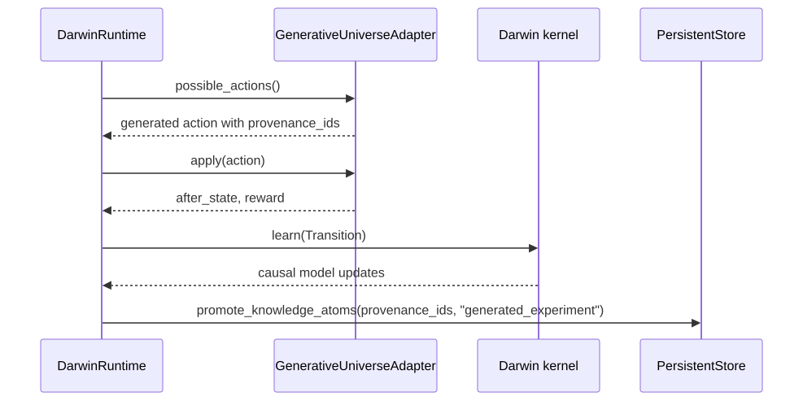

# Darwin v4 Sandboxed Worlds

Generated worlds are data-only simulation schemas. They let Darwin test
corpus-derived causal hypotheses without executing generated code or treating
corpus text as trusted reality.

Implemented in `src/darwin/generative.py`.

## Core classes

| Class | Role |
| --- | --- |
| `WorldSpec` | Data-only generated simulation schema |
| `ActionSpec` | Generated action plus rule specs and provenance IDs |
| `RuleSpec` | A permitted state mutation: `add`, `set`, or `toggle` |
| `WorldSpecGenerator` | Builds specs from `KnowledgeGraph.causal_hypotheses()` |
| `SandboxedWorldCompiler` | Validates a `WorldSpec` before activation |
| `SandboxedGeneratedAdapter` | Executes one validated world spec |
| `GenerativeUniverse` | Combines multiple generated adapters |
| `GenerativeUniverseAdapter` | Exposes generated worlds through Darwin's adapter protocol |

## World generation path



## `WorldSpec`

```python
@dataclass
class WorldSpec:
    name: str
    description: str
    concepts: list[str]
    initial_state: State
    actions: list[ActionSpec]
    provenance_ids: list[str]
    trust_level: str = "sandboxed"
    contains_code: bool = False
    step_budget: int = 10_000
```

Generated from `Force causes acceleration`, the current generator creates a
shape like:

```text
name: generated/force_acceleration
initial_state:
  force.acceleration: 0.0
  force.interventions: 0
action:
  generated/apply_force
rules:
  add 1.0 to force.acceleration
  add 1 to force.interventions
provenance_ids:
  <atom_id for Force causes acceleration>
```

This is deliberately minimal. It creates a sandbox where Darwin can observe a
controlled transition; it is not a physics engine.

## Validation rules

`SandboxedWorldCompiler.validate()` rejects specs when:

- `contains_code` is true
- `trust_level` is not `sandboxed`
- there are no actions
- state variable names do not match `domain.variable` style
- generated actions do not start with `generated/`
- rule operations are not in `add`, `set`, `toggle`
- `add` operands are not numeric



## Adapter protocol

`GenerativeUniverseAdapter` uses the same protocol as v3 embodiment adapters:

```python
def observe(self) -> State: ...
def possible_actions(self) -> list[Action]: ...
def apply(self, action: Action) -> tuple[State, float]: ...
```

It also exposes helpers used by the v4 runtime and CLI:

- `action_metadata(action)` - includes `generated=True`, `world`, `domain`, and
  `provenance_ids`
- `actions_for_terms(terms)` - lets semantic attention pick relevant generated
  actions
- `variables_for_domain(domain)` - lets experiment proposals stay inside the
  active generated world

## Belief promotion in generated worlds



Promotion means the atom's provenance now has generated-experiment support. It
does not mean Darwin has solved the real-world domain. It means Darwin has
observed support inside the sandbox generated from that hypothesis.

## v4 brain startup

`darwin brain --kernel v4` calls `_build_v4_adapter(store)`:



If memory is empty, Darwin starts with a tiny `generated/curiosity_bootstrap`
world so the brain can still run. That bootstrap world is a placeholder, not a
claim of broad knowledge.

## Current limits

- The generator only uses `causal_hypothesis` atoms.
- Rules are simple state mutations; no generated code is allowed.
- There is no invariant solver or high-fidelity simulator in this branch.
- Validation results have a table in SQLite, but validation is not yet recorded
  as a first-class audit log.
- Generated experiment outcomes are recorded through the existing `experiments`
  table; the `generated_experiments` table exists for future specialization.
