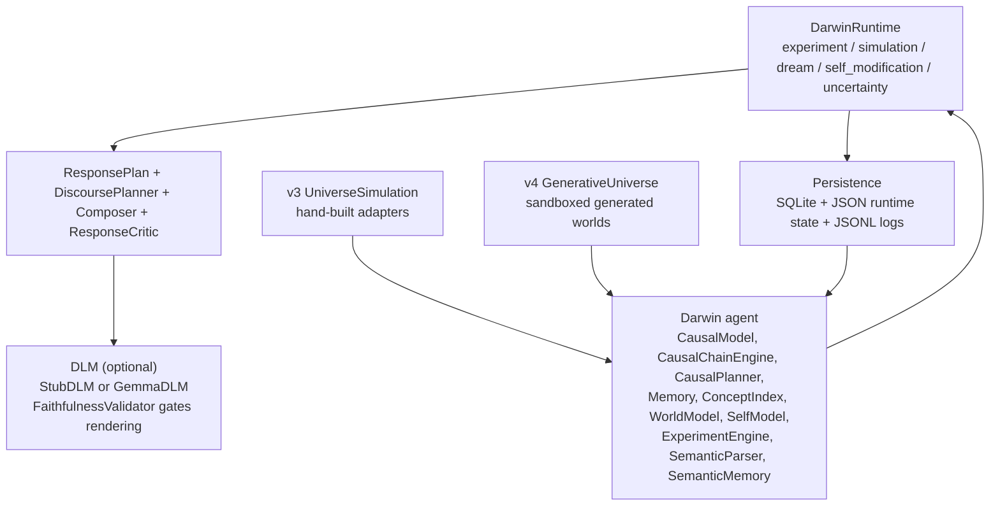
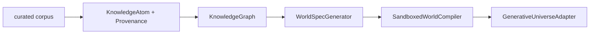

# Architecture Overview

Darwin is organized as a single Python package (`darwin/`) with no external
runtime dependencies for the core mind. The DLM optionally talks to a local
Ollama / llama-cpp / transformers backend; everything else is stdlib.

Current branch note: Darwin v4 keeps the v2/v3 symbolic + causal kernel and
adds the Generative Universe substrate. See
[V4 Generative Universe Kernel](V4-Generative-Universe-Kernel.md) for the v4
deep dive.

## Layered view

## v4 corpus-to-world layer

Corpus claims can propose hypotheses. They do not become causal beliefs until
Darwin acts in a generated sandbox world and observes a transition.

## The cognitive cycle for a chat turn

1. `interpret_language(user_text)` — `SemanticParser` builds a
   `SemanticFrame` with speech act, topic, groundings, propositions,
   goals, values, unknown terms, and a confidence score.
2. `ContextRetriever.retrieve(...)` — produces a `RetrievalPacket`
   ranking semantic frames, concepts, causal beliefs, runtime events,
   episodic transitions, and completed experiments by relevance.
3. `DiscoursePlanner.plan(...)` — picks a mode (`question`,
   `belief_answer`, `learn`, `clarify`, `experiment`, etc.) and emits
   a `ResponsePlan` carrying:
   - `thesis`, `answer_points`, `evidence`, `next_actions`
   - **`causal_claims`** (action, variable, effect, confidence, samples)
   - **`uncertainty_levels`** (target, level, reason)
   - **`referenced_experiences`** (kind, title, summary, score)
   - `self_reflection`, `tone`, `target_length`, `plan_id`
4. `DLM.render(plan, frame, trace)` — `StubDLM` (composer) or
   `GemmaDLM` (gemma-3-270m). Output is checked by
   `FaithfulnessValidator`. On rejection → composer fallback.
5. `ResponseCritic.evaluate(plan, draft, ...)` — enforces uncertainty
   disclosure, presence of high-confidence causal claims, no
   parser-notation leaks, no overconfidence, no thin replies. On
   failure → revise plan, re-render, re-check.
6. Persist: `Transition`, `SemanticFrame`, `ResponsePlan`, `Critique`,
   `ThoughtTrace`, training pair, structured log.
7. Emit a `RuntimeEvent` of kind `"thought"` on the main loop.

## The cognitive cycle for the 24/7 mind (no user)

Five background loops run concurrently, each in its own thread:

| Loop                | Default interval | What it does |
|---------------------|------------------|--------------|
| `experiment`        | `interval`       | uses `ExperimentEngine` to pick the highest-uncertainty intervention, applies it to the embodiment, learns from the transition. |
| `simulation`        | `1.5 × interval` | `CausalChainEngine.explore_chains(...)` does a mental simulation of action sequences. The highest-uncertainty step is fed back into `SelfModel.prediction_failures` so learning_priority gets sharper. |
| `dream`             | `4 × interval`   | `ConceptIndex.consolidate()` clusters affordances into higher-order concepts and decays stale ones. Emits a reflection. |
| `self_modification` | `6 × interval`   | `SelfModificationEngine` proposes 3 small tweaks (min_samples, exploration rate, planner bias, concept pruning), tests each against held-out transitions, keeps only those that reduce prediction error. |
| `uncertainty`       | `3 × interval`   | scans `causal_model.uncertainty_for(...)` per action. Drives `/uncertainty` and informs the experiment loop. |

Each wake-up emits a `RuntimeEvent` with `event.loop` set, plus a
`BackgroundLogEntry` in `training_logs/background.jsonl`. The brain
process is observable even when no client is connected.

## Persistence and resumption

- `PersistentStore` (SQLite) — transitions, concepts, thoughts, chat
  messages, experiments, plans, semantic frames, self-modification
  proposals.
- `darwin_runtime_state.json` — current Darwin time, exploration rate,
  `min_samples`, planner overrides, per-loop snapshots.

On startup `Darwin.from_store(...)` rehydrates all transitions and
semantic frames; `DarwinRuntime` restores the JSON state. The mind
resumes with the same internal posture it had at last shutdown.

## Daemon split

`DarwinDaemon` exposes the runtime over a TCP JSON-line protocol. Each
client connection gets its own writer thread with a bounded queue, so a
slow client cannot stall background cognition. Clients explicitly opt
in to the event firehose via `{"cmd": "subscribe"}`; by default
`darwin connect` is a silent chat REPL.

See [Brain Daemon Protocol](Protocol-Reference.md) for wire details.
