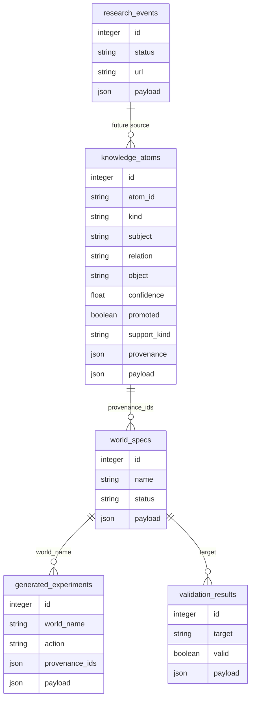

# Persistence and State

Darwin's mind survives restarts because every important piece of
state has a durable home. This page describes what lives where, how
it is restored, and how to move or back up the mind.

## SQLite: `darwin_memory.sqlite3`

The durable structured store, opened by `PersistentStore`
(`darwin/storage.py`). Tables:

| Table | Records |
| --- | --- |
| `transitions` | every `Transition(before, action, after, reward, t, metadata)` |
| `concepts` | the concept hierarchy (one row per concept, upserted by name) |
| `thoughts` | every reflection, response plan, critique, thought-trace, runtime event other than chat |
| `chat_messages` | every chat message (user + darwin) |
| `experiments` | every proposed + evaluated experiment |
| `plans` | every multi-step plan |
| `semantic_frames` | every parsed `SemanticFrame` (user + darwin) |
| `self_modifications` | every proposed self-modification + outcome |
| `knowledge_atoms` | v4 corpus-derived atoms with provenance and promotion state |
| `world_specs` | v4 generated sandbox world specs |
| `generated_experiments` | reserved v4 generated-experiment table |
| `validation_results` | reserved v4 validation-result table |
| `research_events` | reserved v4 live-research event table |

## v4 data model



Current v4 writes are `knowledge_atoms` and `world_specs`, with generated
experiment outcomes recorded through the existing `experiments` table.
`generated_experiments`, `validation_results`, and `research_events` exist as
schema surface for the next stages.

On startup, `Darwin.from_store(actions, store)` rehydrates:

1. all transitions via `store.load_transitions()` — replays them
   through `darwin.learn(...)` so causal, memory, world, and self
   models are exactly where they were
2. all semantic frames via `store.load_semantic_records()` — replays
   them through `semantic_memory.learn(...)` so propositions, goals,
   values, and unknown-term counters are restored

The replay is deterministic and idempotent.

## JSON: `darwin_runtime_state.json`

Runtime posture that does not belong in SQLite. Written on `stop()`,
read on construction:

```json
{
  "loops": {
    "experiment":        {"last_event": "experiment",    "last_time": 1758...},
    "simulation":        {"last_event": "simulation",    "last_time": 1758...},
    "dream":             {"last_event": "dream",         "last_time": 1758...},
    "self_modification": {"last_event": "self_modification", "last_time": 1758...},
    "uncertainty":       {"last_event": "uncertainty",   "last_time": 1758...}
  },
  "darwin_time": 142,
  "exploration_rate": 0.22,
  "min_samples": 3,
  "planner_overrides": {"exploration_bias": 1.2},
  "saved_at": 1758...
}
```

`darwin_time`, `exploration_rate`, `min_samples`, and
`planner_overrides` are restored automatically on construction. This
is what makes `SelfModificationEngine`-accepted changes truly persist
— without this file, an accepted `exploration_bias=1.2` would reset
to default on restart.

## JSONL logs: `training_logs/*.jsonl`

| File | Producer | Contains |
| --- | --- | --- |
| `plans.jsonl` | `StructuredLogger.log_plan` | every `(plan, rendering, critique, trace, renderer)` from chat turns |
| `background.jsonl` | `StructuredLogger.log_background` | every wake-up of every background loop (kind, content, payload, duration_ms) |
| `metrics.jsonl` | `StructuredLogger.log_metric` | named metrics over time |
| `dlm_training_pairs.jsonl` | `TrainingDataCollector.add` | `(plan_payload, rendering, renderer, critique_passed, quality)` pairs |

These are append-only. They are gitignored by default. You can
truncate them safely; the SQLite + JSON state files are the source of
truth for the mind.

## Moving the mind

```bash
# Stop the brain (Ctrl-C in the brain terminal)
# Copy the three things that matter
cp darwin_memory.sqlite3 /backup/
cp darwin_runtime_state.json /backup/
cp -r training_logs /backup/  # optional; logs are for analysis, not state

# On the new host
darwin brain --memory /restored/darwin_memory.sqlite3
```

The runtime state file path is currently fixed at
`darwin_runtime_state.json` in the working directory. Run the brain
from a stable directory if you want this to persist:

```bash
cd ~/darwin-state
darwin brain --memory ./mem.sqlite3
```

## Resetting

If you want a fresh mind:

```bash
rm darwin_memory.sqlite3 darwin_runtime_state.json
rm -rf training_logs
```

Then `darwin brain` again. Darwin will start over with no causal
beliefs, no concepts, no semantic memory.

## What is NOT persisted

- The runtime's in-memory `events` ring buffer (last 500 events).
  These are streamed to subscribed clients and written to
  `training_logs/background.jsonl`, but the in-memory ring is
  recreated empty on restart.
- The renderer cache inside `GemmaDLM` (re-instantiated lazily on
  first call).
- The TCP socket itself (the daemon obviously needs to be started
  again to accept new clients).

Everything that defines "who Darwin is" — its causal beliefs, its
concept hierarchy, its semantic memory, its self-modification
history, its accepted tuning — is on disk and replayable.
