# V4 Corpus to World Pipeline

The v4 pipeline turns curated local corpus files into sandbox worlds. The rule
is strict: corpus claims can propose hypotheses, but they do not become causal
beliefs automatically.

## End-to-end flow


## Knowledge atoms

`KnowledgeAtom` is implemented in `src/darwin/knowledge.py`.

| Field | Meaning |
| --- | --- |
| `kind` | `definition`, `relation`, `quantity`, `alias`, or `causal_hypothesis` |
| `subject` | the thing the atom is about |
| `relation` | relation text such as `is`, `causes`, `alias` |
| `object` | target or value |
| `text` | source sentence/snippet |
| `provenance` | source metadata |
| `confidence` | extractor confidence for the atom |
| `promoted` | whether generated experience has supported it |
| `support_kind` | usually `corpus`, later `generated_experiment` |

`Provenance` stores `source_type`, `source_id`, `extractor`, `confidence`, and
`captured_at`.

## Supported inputs

Text/Wikipedia-style input:

```text
== Force ==
Force is an interaction that changes motion.
Force causes acceleration.
Aliases: push, pull
```

Wikidata-style JSONL:

```json
{"id":"Q1","label":"Force","description":"interaction that changes motion","aliases":["push","pull"],"claims":{"causes":["acceleration"]}}
```

The current `wikidata` path records claim values as `relation` atoms. Text
sentences with explicit "causes", "changes", "affects", or "resists" wording are
the current path to `causal_hypothesis` atoms.

## Belief promotion


When a generated action runs, its metadata carries `provenance_ids`. The runtime
uses those IDs to promote corresponding atoms after Darwin learns from the
transition.

## Data model



Current active writes are `knowledge_atoms`, `world_specs`, and the existing
`experiments` table. `generated_experiments`, `validation_results`, and
`research_events` exist as v4 schema surface for future work.

## Why generated worlds are sandboxed

Generated worlds are data specs. The compiler rejects specs that contain code,
use unsupported operations, have invalid variable names, or expose non-generated
actions.

Allowed rule operations today:

- `add`
- `set`
- `toggle`

That keeps generated worlds inspectable and prevents the corpus pipeline from
turning arbitrary text into executable behavior.
