# V4 Generative Universe Kernel

Darwin v4 is the Generative Universe Kernel. It keeps Darwin's symbolic/causal
mind as the source of reasoning and adds a path for growing sandbox worlds from
curated corpus claims.

Darwin is not an LLM, not a prompt chain, and not an API wrapper. Gemma, when
enabled, is only the DLM: the mouth that renders structured Darwin response
plans into prose.

## Architecture


## What exists now

- `darwin ingest-corpus --source wikipedia|wikidata|wikidump --path PATH --memory PATH`
- `darwin brain --kernel v4 --workers auto --accelerator auto`
- unchanged `darwin connect`
- deterministic corpus extraction in `src/darwin/knowledge.py`
- generated world specs and sandbox compiler in `src/darwin/generative.py`
- scheduler/metrics surface in `src/darwin/kernel.py`
- dormant disabled live research in `src/darwin/research.py`
- v4 persistence tables in `src/darwin/storage.py`
- v4 introspection commands in `src/darwin/server.py`

## What v4 changes



v3 gives Darwin a fixed set of hand-built worlds. v4 gives Darwin a persisted,
queryable substrate for generating sandbox worlds from explicit causal
hypotheses.

## What v4 does not claim

- It is not finished universal sentience.
- It does not ingest the full web.
- It does not treat Wikipedia or Wikidata as truth.
- It does not execute generated code.
- It does not make Gemma responsible for intelligence.
- It does not yet replace the existing background-loop runtime with a complete
  actor runtime.

## Quickstart

```bash
cat > /tmp/darwin-force.txt <<'EOF'
== Force ==
Force is an interaction that changes motion.
Force causes acceleration.
Aliases: push, pull
EOF

darwin ingest-corpus \
  --source wikidump \
  --path /tmp/darwin-force.txt \
  --memory /tmp/darwin-v4.sqlite3

darwin brain \
  --kernel v4 \
  --workers auto \
  --accelerator auto \
  --memory /tmp/darwin-v4.sqlite3
```

In another terminal:

```bash
darwin connect
```

Try:

```text
/knowledge force
/hypotheses
/worlds
/mind
/research status
```

## Related pages

- [V4 Corpus to World Pipeline](V4-Corpus-to-World-Pipeline.md)
- [V4 Using Gemma as the Mouth](V4-Using-Gemma-as-the-Mouth.md)
- [Architecture](Architecture.md)
- [CLI Reference](CLI-Reference.md)
