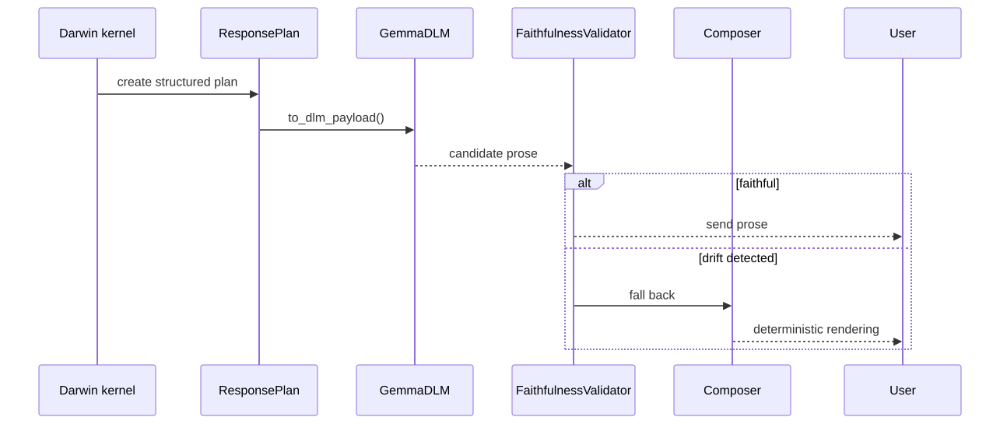

# V4 Using Gemma as the Mouth

Gemma is optional in Darwin v4. When used, it is the Darwin Language Module
(DLM): a mouth that renders Darwin's structured `ResponsePlan` into prose.

It is not the mind. It does not reason for Darwin, choose claims, create causal
beliefs, or decide whether corpus claims are true.

## Boundary diagram



## What Darwin owns

- query of `KnowledgeGraph`
- causal beliefs in `CausalModel`
- generated experiments in sandbox worlds
- confidence and uncertainty
- whether a claim is corpus-only or promoted
- response mode and intent
- the exact `ResponsePlan` contract

## What Gemma owns

- surface phrasing
- sentence flow
- tone within the plan's requested tone and length

Gemma receives `ResponsePlan.to_dlm_payload()`. It does not receive permission
to invent facts.

## Run with Gemma

```bash
ollama pull gemma3:270m

darwin brain \
  --kernel v4 \
  --dlm gemma \
  --dlm-backend ollama \
  --dlm-model gemma3:270m
```

Default without Gemma:

```bash
darwin brain --kernel v4 --dlm stub
```

## Validator behavior



The validator can reject output for:

- missing high-confidence causal claims
- unsurfaced uncertainty
- hallucinated numbers
- parser/debug notation leaks
- forbidden generic "AI training" phrasing
- missing clarification questions
- length drift

## Why this matters in v4

v4 adds corpus ingestion and generated worlds. That makes the mouth boundary
more important, not less. The system must not let a language model:

- treat a corpus claim as promoted support
- infer a world rule that the sandbox compiler did not validate
- claim live research has run when the subsystem is disabled
- turn a generated sandbox transition into a universal real-world statement

The correct framing is:

> Darwin's kernel reasons. Gemma renders. Validation keeps the rendering tied to
> the plan.
